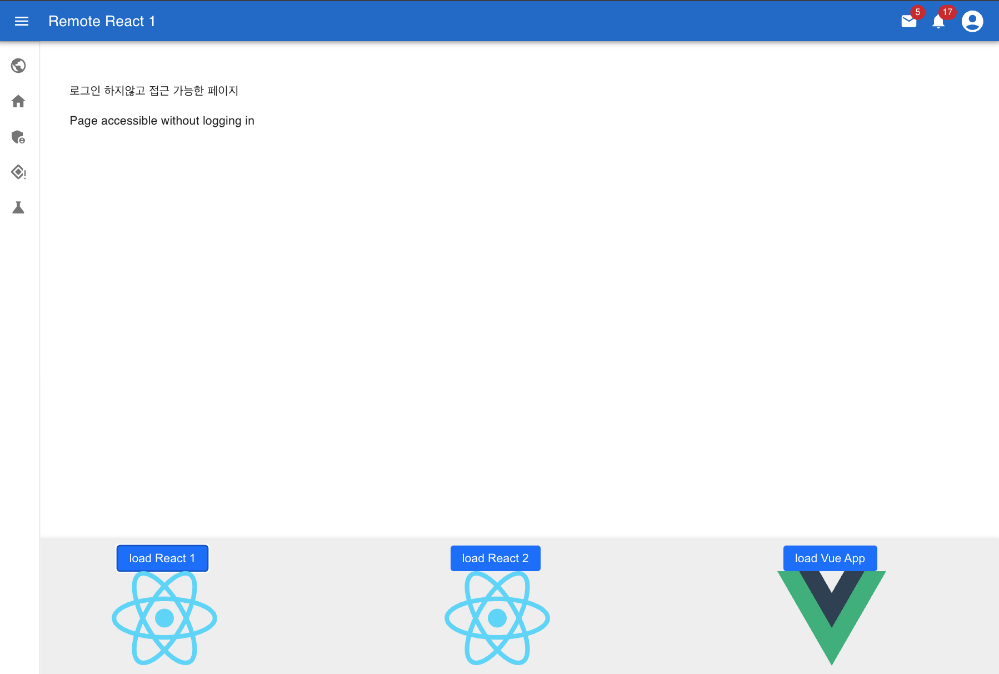

# mono-multi-framework-federation



# TL;DR
- directorys
```
 /apps
    ㄴ hive // host App
    ㄴ remote-react1 // react1
    ㄴ remote-react2 // react2
    ㄴ remote-vue // vue
```

 - how to run
   **Pre-work**: Open three terminals.
 ```shell 
  pnpm build:remotes:watch # run in terminal 1
  pnpm preview:remotes # run in terminal 2
  pnpm dev:host # run in terminal 3
 ```

 # Who is it suitable for?
   - **조직간 서비스 프레임워크가 다를 경우**
    A본부 서비스는 react, B본부 서비스는 Vue, 외주사가 개발한 서비스는 Svelte 등 서로다른 프레임워크로 federation 구성할 경우 적합.
    It is suitable to configure federation with different frameworks, such as React for Headquarters A's service, Vue for Headquarters B's service, and Svelte for services developed by outsourcing companies.
 

  - **완전히 독립된 조직들이 하나의 도메인으로 통합되어야 할때**
    app 단위로 독립되어 랜더링 됨.즉,원격으로 제공받은 n개의 app이 동시에 존재하지 않음을 보장.
    Rendered independently on an app-by-app basis. That is, it ensures that n remotely provided apps do not exist simultaneously.

  - **apps/\*서비스들이 쉽게 multi-Repository로 전환 할 수 있도록 구성**
    같은 company도 아니고, 완전히 다른 보안 규정을 가진 company가 서비스를 개발 할 수 있다는 전제까지 고려하여 구성.
    It is structured taking into account the premise that a service can be developed by a company that is not even the same company, but has completely different security regulations.
    


# Tip
- add Dependency
  -  pnpm add jwt-decode --filter iaas
  -  pnpm -filter @hive/rest-client build
 